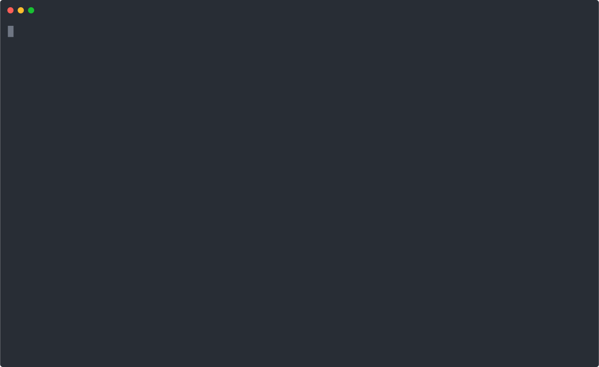
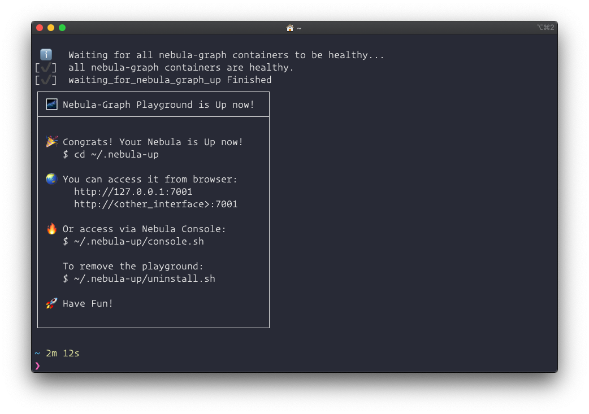

# Nebula-Up

> News: If you would like to try NebulaGraph(not all toolings) from your desktop env, it's recommended to try with [NebulaGraph Docker Extension on Docker Desktop](https://hub.docker.com/extensions/weygu/nebulagraph-dd-ext) for macOS and Windows, all you need is one-click.

> Update: the All-in-one mode is introduced! Check [here](#all-in-one-mode) and try it!

[](https://asciinema.org/a/407151 "Nebula Up Demo")

`Nebula-Up` is a PoC utility to enable developer to bootstrap an nebula-graph cluster with nebula-graph-studio(Web UI) + nebula-graph-console(Command UI) ready out of box in an oneliner run. All required packages will be handled with `nebula-up` as well, including Docker on Linux(Ubuntu/CentOS), Docker Desktop on macOS(including both Intel and M1 chip-based), and Docker Desktop Windows.

Also, it's optimized to leverage China Repo Mirrors(docker, brew, gitee, etc...) in case needed to enable a smooth deployment for both Mainland China users and others.

macOS and Linux with Shell:

```bash
curl -fsSL nebula-up.siwei.io/install.sh | bash
```


Note: you could specify the version of NebulaGraph like:

```bash
curl -fsSL nebula-up.siwei.io/install.sh | bash -s -- v3
```

## All-in-one mode

With all-in-one mode, you could play with many Nebula Tools in one command, too:


Roadmap:
- [x] Nebula Dashboard
- [x] NebulaGraph Studio
- [x] NebulaGraph Console
- [x] Nebula BR(backup & restore)
- [x] NebulaGraph Spark utils
  - [x] NebulaGraph Spark Connector/PySpark REPL
  - [x] NebulaGraph Algorithm
  - [x] NebulaGraph Algorithm in Jupyter Notebook and PySpark
  - [x] NebulaGraph Exchange
- [x] NebulaGraph Importer
- [ ] NebulaGraph Fulltext Search
- [ ] Nebula Bench
- [ ] Nebula Client REPL
  - [ ] Try Python SDK in iPython
  - [ ] Try Java SDK in REPL
- [ ] Nebula Build, Debug and Dev Env
- [ ] Nebula Flink Connector Playground
- [x] NebulaGraph + DGL(Deep Graph Library)
- [x] NebulaGraph Data Intelligence Suite(ngdi) Playground
  - [x] Read, WRite, Algo on Spark engine
  - [x] Call ngdi algo from ngdi_graphd with UDF

### Install all in one
```bash
# Install Nebula Core with all-in-one mode
curl -fsSL nebula-up.siwei.io/all-in-one.sh | bash
```

### Install Nebula Core and One of the coponent:
```bash
# Install Core with Backup and Restore with MinIO
curl -fsSL nebula-up.siwei.io/all-in-one.sh | bash -s -- v3 br
# Install Core with Spark Connector, Nebula Algorithm, Nebula Exchange
curl -fsSL nebula-up.siwei.io/all-in-one.sh | bash -s -- v3 spark
# Install Core with Dashboard
curl -fsSL nebula-up.siwei.io/all-in-one.sh | bash -s -- v3 dashboard
```

### How to play with all-in-one mode:

#### Console and Basketballplayer Dataset Loading
Then you could call Nebula Console like:
```bash
# Connect to nebula with console
~/.nebula-up/console.sh
# Execute queryies like
~/.nebula-up/console.sh -e "SHOW HOSTS"
# Load the sample dataset
~/.nebula-up/load-basketballplayer-dataset.sh
# Make a Graph Query the sample dataset
~/.nebula-up/console.sh -e 'USE basketballplayer; FIND ALL PATH FROM "player100" TO "team204" OVER * WHERE follow.degree is EMPTY or follow.degree >=0 YIELD path AS p;'
```
#### Monitor the whole cluster with Nebula Dashboard

Visit http://127.0.0.1:7003 with user: `root`, password: `nebula`.

> Note, thanks to the sponsorship of Microsoft, we have a demo site of Nebula-UP on Azure: you could visit the dashboard here: http://nebula-demo.siwei.io:7003 .
#### Access NebulaGraph Studio

Visit http://127.0.0.1:7001 with user: `root`, password: `nebula`, host: `graphd:9669`(for non-all-in-one case, this should be `<host-ip>:9669`).

> Note, thanks to the sponsorship of Microsoft, we have a demo site of Nebula-UP on Azure: you could visit the studio here: http://nebula-demo.siwei.io:7001 .

#### Query Data with Nebula Spark Connector in PySpark Shell

Or play in PySpark like:
```bash
~/.nebula-up/nebula-pyspark.sh

# call Nebula Spark Connector Reader
df = spark.read.format(
  "com.vesoft.nebula.connector.NebulaDataSource").option(
    "type", "vertex").option(
    "spaceName", "basketballplayer").option(
    "label", "player").option(
    "returnCols", "name,age").option(
    "metaAddress", "metad0:9559").option(
    "partitionNumber", 1).load()

# show the dataframe with limit 2
df.show(n=2)
```

The output may look like:

```python
      ____              __
     / __/__  ___ _____/ /__
    _\ \/ _ \/ _ `/ __/  '_/
   /__ / .__/\_,_/_/ /_/\_\   version 2.4.5
      /_/

Using Python version 2.7.16 (default, Jan 14 2020 07:22:06)
SparkSession available as 'spark'.
>>> df = spark.read.format(
...   "com.vesoft.nebula.connector.NebulaDataSource").option(
...     "type", "vertex").option(
...     "spaceName", "basketballplayer").option(
...     "label", "player").option(
...     "returnCols", "name,age").option(
...     "metaAddress", "metad0:9559").option(
...     "partitionNumber", 1).load()
>>> df.show(n=2)
+---------+--------------+---+
|_vertexId|          name|age|
+---------+--------------+---+
|player105|   Danny Green| 31|
|player109|Tiago Splitter| 34|
+---------+--------------+---+
only showing top 2 rows
```

#### Run Nebula Exchange

Or run an example Nebula Exchange job to import data from CSV file:
```bash
~/.nebula-up/nebula-exchange-example.sh
```
You could check the example configuration file in `~/.nebula-up/nebula-up/spark/exchange.conf`

#### Run NebulaGraph Algorithm

> Reference: https://github.com/wey-gu/nebula-livejournal

Load LiveJournal dataset with Nebula Importer:

```bash
~/.nebula-up/load-LiveJournal-dataset.sh
```

Run Nebula Algorithm like:

```bash
~/.nebula-up/nebula-algo-pagerank-example.sh
```

#### Run NebulaGraph Algorithm from Jupyter Notebook with PySpark

Visit Jupyter Notebook with http://127.0.0.1:8888 with token: `nebula`.

Refer to the [example notebook](https://github.com/wey-gu/nebula-up/blob/main/spark/pagerank_example.ipynb) in `~/.nebula-up/nebula-up/spark/notebook/`

#### Try Backup and Restore with MinIO as Storage

```bash
# Create a full backup to MinIO(Be sure to run load-basketballplayer-dataset.sh before doing so)
~/.nebula-up/nebula-br-backup-full.sh
# Show all backups
~/.nebula-up/nebula-br-show.sh
# Restore to a backup named BACKUP_2022_05_08_11_38_08
~/.nebula-up/nebula-br-restore-full.sh BACKUP_2022_05_08_11_38_08
```

Note, you could also browser files in MinIO with from http://127.0.0.1:9001 with user: `minioadmin`, password: `minioadmin`.

> Note, thanks to the sponsorship of Microsoft, we have a demo site of Nebula-UP on Azure: you could visit the MinIO site here: http://nebula-demo.siwei.io:9001 .

**Limitation**: BR in Nebula-UP is not fully-functional for now. Please expect to restore failure in the final phases.

#### Play with NebulaGraph and Deep Graph Library(DGL)

Please refer to [NebulaGraph-DGL Playground](https://github.com/wey-gu/nebula-dgl#playground).

--------------------------------------------

## Support matrix

Please, help issue or PR to add your new verified cases.

> ❓ stands for not verified/supported yet.

### Support matrix per function

| Function/Platform | x86_Linux | x86_macOS             | x86_win               | arm_Linux                          | arm_macOS                          |
| ----------------- | --------- | --------------------- | --------------------- | ---------------------------------- | ---------------------------------- |
| NebulaGraph       | ✅         | ✅(via Docker Desktop) | ✅(via Docker Desktop) | ✅                                  | ✅(via Docker Desktop)              |
| Studio            | ✅         | ✅(via Docker Desktop) | ✅(via Docker Desktop) | ✅(via Docker-emulated x86 Desktop) | ✅(via Docker Desktop-emulated x86) |
| Console           | ✅         | ✅                     | ✅                     | ✅                                  | ✅                                  |
| Dashboard         | ✅         | ✅(via Docker Desktop) | ✅(via Docker Desktop) | ✅(via tonistiigi/binfmt)           | ✅(via Docker Desktop-emulated x86) |
| BR                | ✅         | ❓                     | ❓                     | ❓                                  | ❓                                  |
| Spark             | ✅         | ❓                     | ❓                     | ❓                                  | ❓                                  |
| Importer          | ✅         | ❓                     | ❓                     | ❓                                  | ❓                                  |


### Support matrix per command

| Command /Platform                                            | x86_Linux | x86_macOS | x86_win | arm_Linux | arm_macOS |
| ------------------------------------------------------------ | --------- | --------- | ------- | --------- | --------- |
| `curl -fsSL nebula-up.siwei.io/install.sh \| bash`           | ✅         | ✅         | ✅       | ✅         | ✅         |
| `curl -fsSL nebula-up.siwei.io/all-in-one.sh \| bash`        | ✅         | ❓         | ❓       | ❓         | ❓         |
| `curl -fsSL nebula-up.siwei.io/all-in-one.sh \| bash -s -- v3 dashboard` | ✅         | ✅         | ✅       | ✅         | ✅         |
| `curl -fsSL nebula-up.siwei.io/all-in-one.sh \| bash -s -- v3 br` | ✅         | ❓         | ❓       | ❓         | ❓         |
| `curl -fsSL nebula-up.siwei.io/all-in-one.sh \| bash -s -- v3 br` | ✅         | ❓         | ❓       | ❓         | ❓         |


--------

TBD:
- [ ] Finished Windows(Docker Desktop instead of the WSL 1&2 in initial phase) part, leveraging chocolatey package manager as homebrew was used in macOS
- [ ] Fully optimized for CN users, for now, git/apt/yum repo were not optimised, newly installed docker repo, brew repo were automatically optimised for CN internet access
- [ ] Packaging similar content into homebrew/chocolatey?
- [ ] CI/UT

